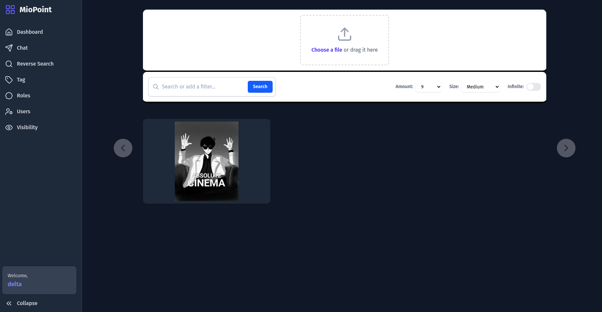

# 🎬 MioPoint Frontend ✨

Welcome to the official Svelte frontend for **MioPoint**! This project provides a sleek, modern, and reactive user interface for a synchronized collaboration platform.

🔗 **Backend Repository:** [delta-dash/MioPoint](https://github.com/delta-dash/MioPoint)

<p align="center">
  
</p>

---

## 🌟 Key Features

*   **📂 File Viewing:** View images and videos.
*   **💬 Chat:** Private messaging for you and friends.
*   **🚪 Room Management:** Easily create and join private collaboration rooms.
*   **⚡ Blazing Fast UI:** Built with SvelteKit for a seamless and responsive experience.

---

## 🛠️ Tech Stack

This project is built with an incredibly fast and modern web stack:

*   **Framework:** [SvelteKit](https://kit.svelte.dev/) 🧡
*   **Runtime & Toolkit:** [Bun](https://bun.sh/) 🍞
*   **Styling:** [Tailwind CSS](https://tailwindcss.com/) 💨
*   **Language:** TypeScript 🟦

---

## 🚀 Getting Started

To get a local copy up and running, follow these simple steps.

### Prerequisites

This project uses [Bun](https://bun.sh/) as its runtime and package manager. You'll need to have it installed on your system.

*   **Install Bun** (macOS, Linux, WSL):
    ```sh
    curl -fsSL https://bun.sh/install | bash
    ```

### Installation & Running

1.  **Fork & Clone the repository**
    ```sh
    git clone https://github.com/delta-dash/MioPoint-frontend.git
    ```
2.  **Navigate to the project directory**
    ```sh
    cd MioPoint-frontend
    ```
3.  **Install dependencies with Bun**
    ```sh
    bun install
    ```
4.  **Start the development server**
    ```sh
    bun run dev
    ```
    Your app should now be running on `http://localhost:5173`! 🔥

---

## 🗺️ Roadmap & TODOs

We have a lot of exciting plans, but here are our immediate priorities:

*   [ ] 📂 **Implement core synchronized file viewing logic.**
*   [ ] 🐞 Fix the production build error.
*   [ ] 🔄 Resolve the state synchronization effect loop.
*   [ ] ✨ Implement new UI enhancements for file display.
*   [ ] 🌐 Add i18n for internationalization.

See the [open issues](https://github.com/delta-dash/MioPoint-frontend/issues) for a full list of proposed features and known bugs.

---

## 🤝 Contributing

Contributions are what make the open-source community such an amazing place to learn, inspire, and create. Any contributions you make are **greatly appreciated**! 🙏

If you'd like to help improve Miopoint, please follow these steps:

1.  **Fork** the Repository 🍴
2.  Create your Feature Branch (`git checkout -b feature/AmazingFeature`)
3.  Commit your Changes (`git commit -m 'Add some AmazingFeature'`)
4.  Push to the Branch (`git push origin feature/AmazingFeature`)
5.  Open a **Pull Request** 📬

---

## ⚖️ License

Distributed under the MIT License. See `LICENSE` for more information.